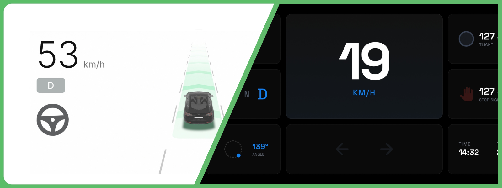

# Dashpilot

Turn your phone into a real-time dashboard for your car.

## Project structure

`/adasviz`:  

Contains the Bevy rendering engine used in `/pilotboard` that is capable of rendering vehicles, lanes, traffic lights and many more.

`/dash-apps`:  

Contains source code for apps running in the sandbox dashpilot mobile app. They fall into two main categories: web apps, and rive apps. See the dash-apps readme for more.

`/dashpilot-android`:  

The android app the hosts a full screen webview inside which `/dash-apps` run.

`/simulator`:  

A python based websocket server and simulator. It can generate dynamic scenarios for `adasviz`, and can also replay `routes` recorded from a modified version of openpilot's Cabana.

## How to run

1. build `adasviz`:  
 
Run `./build_adasviz.sh`, this will generate the `.wasm` and `.js` bindings for `adasviz` which is used in `pilotboard`.

2. Start the simulator:  

`python3 server.py --route '/Users/ahmedharmouche/Documents/car-surroundings/simulator/routes/route.jsonl'`

3. Run the pilotboard:  

`cd ./pilotboard`
`serve .`

4. Open the served `pilotboard` in your browser
